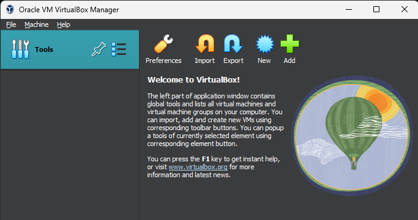
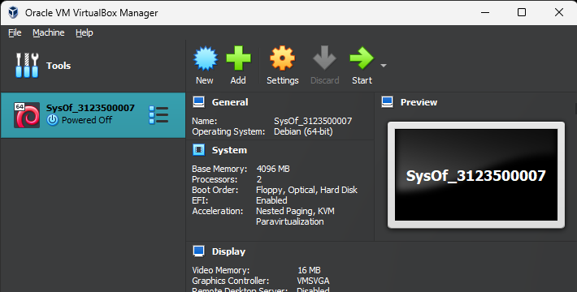
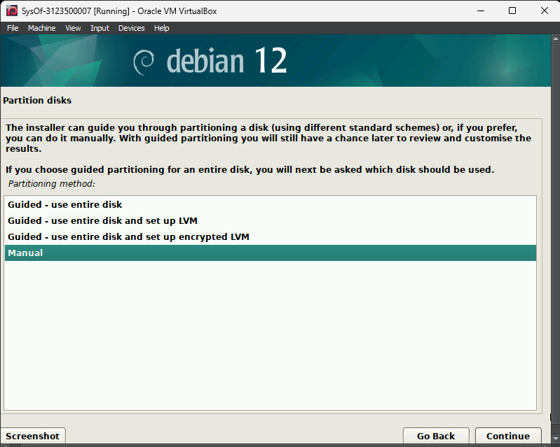
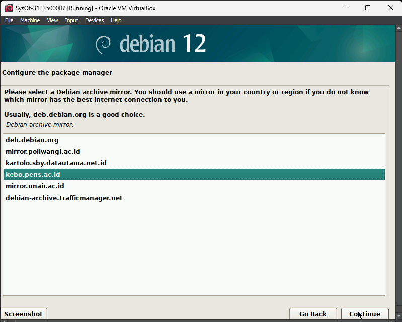
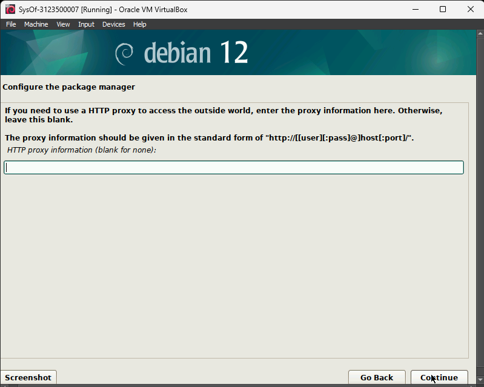

    <h1 style="text-align: center;font-weight: bold">Praktikum 1 SysOp</h1>
    <h4 style="text-align: center;">Dosen Pengampu : Dr. Ferry Astika Saputra, S.T., M.Sc.</h4>
  

   
  

    
    <h3 style="text-align: center;">Disusun Oleh : </h3>
    

      <strong>Roihanah Inayati Bashiroh (3123500005)</strong> 
      <strong>Dio Ramadhan Widya Pamungkas (3123500011)</strong> 
      <strong>Ragil Ridho Saputra (3122500016)</strong>
    

    <h3 style="text-align: center;line-height: 1.5">Politeknik Elektronika Negeri Surabaya Departemen Teknik Informatika Dan Komputer Program Studi Teknik Informatika 2023/2024</h3>
  

  

  

  
  # Daftar Isi
  1. [Pendahuluan](#sistem-operasi)
  2. [Soal](#soal)
  3. [Referensi](#referensi)
  
  
  # Sistem Operasi
  Sistem operasi adalah perangkat lunak yang bertanggung jawab untuk mengelola sumber daya perangkat keras dan menyediakan
  antarmuka bagi pengguna dan aplikasi untuk berinteraksi dengan komputer. Ini mengkoordinasikan tugas-tugas seperti
  alokasi memori, penjadwalan CPU, manajemen file, dan penyediaan layanan jaringan, memungkinkan pengguna untuk
  menjalankan program dengan efisien dan menjalankan fungsi-fungsi dasar seperti mengetik, menyimpan, dan mengakses data.
  
  # SOAL
  # 1. Sebutkan dan jelaskan proses booting!
  Proses booting adalah serangkaian langkah yang dilakukan oleh komputer ketika dinyalakan untuk mempersiapkan sistem agar
  siap digunakan. Proses ini meliputi:
  
  1. Menyalakan Komputer
  Kamu menyalakan komputer, PC, atau laptop dengan menekan tombol power.
  
  
  2. Cek Power
  Selanjutnya, power supply akan mengeluarkan sinyal bahwa aliran listrik yang masuk berjalan dengan aman dan normal. Itu
  tandanya komputer siap bekerja.
     CPU Menyala
  Kemudian, apabila aliran daya normal, CPU akan mulai aktif untuk bekerja.
  
  
  3. Cek Perangkat Keras
  Setelahnya, sistem akan memulai pengecekan semua komponen perangkat keras, seperti RAM, penyimpanan atau storage, dan
  komponen lain oleh POST BIOS.
  
  
  4. Loading Driver
  Setelah semua perangkat keras diperiksa dan mampu berjalan baik, masing-masing driver dari komponen akan dijalankan.
     GPU Berjalan
  GPU atau kartu grafis kemudian aktif dengan menampilkan secara visual proses booting di layar. Kartu grafis juga dikenal
  dengan VGA.
     Pemuatan dan Loading Sistem Operasi
  Berikutnya, proses pencarian boot sector yang selanjutnya akan memuat data atau loading sistem operasi yang ada pada
  komputer. Kalau komputermu menggunakan Windows maka akan muncul logo Windows.
  
  
  5. Masuk Desktop
  Terakhir, adalah kamu akan menemukan desktop komputer. Itu artinya, proses booting sukses.
  
  
  Proses booting memungkinkan komputer untuk memulai operasi normalnya dan siap digunakan oleh pengguna.
  
  # 2. Bagaimana cara install Debian 12 di Virtualbox
  
  1.Buka virtual box dan pilih tombol new untuk membuat virtual device
  
  
  2.Beri nama untuk project nya dan pilih iso debian yang ada di storage dan checklist kolom skip
  
  
  3.Atur berapa ram yang ingin di gunakan(sesuaikan dengan ram device) dan core cpu
  
  
  4.Jika sudah maka klik finish untuk menyelesaikan setup
  
  
  5.Akan terdapat pilihan proses booting nya debian pada halaman awal tadi
  
  
  6.Klik 2 kali dan akan memasuki proses penginstalan debian dan pilih graphic install dan akan memunculkan halaman
  tersebut dan pilih english
  
  
  7.Pilih yes pada bagian install the GRUB boot loader dan pilih continue
  
  
  8.Pilih Asia kemudian Indonesia sebagai lokasi kita dan klik continue
  
  
  9.Saat konfigurasi lokal,pilih United States
  
  
  10.Pada bagian konfigurasi keyboard,pilih American English
  
  
  11.Tunggu instalasi sampai selesai,bila sudah selesai masukkan konfigurasi network untuk hostname dan untuk domain kita
  kosongkan
  
  
  

  
  12.Atur Password untuk masuk(yang mudah di ingat)
  
  
  13.Masukkan nama lengkap,username dan password(bedakan dari password sebelum nya) untuk setup user
  
  
  
  
  14.Pilih zona untuk jam,dan pilih Western(tergantung tempat)
  
  
  15.Untuk partition disk pilih manual dan pilih SCSI3 dan pilih yes pada create new empy partition table
  
  
  
  
  16.Pilih pri/log,kemudian create new partition,atur ke 20GB,pilih primary,kemudian pilih beginning dan bootable flag
  ubah ke on dan pilih done
  
  
  
  
  

  17.Setelah di partisi menjadi beberapa bagian,kemudian pilih finish dan tunggu instalasi sampai selesai
  
  
  
  18.Pilih no pada scan extra installation,pilih indonesia untuk debian archive dan pilih kebo.pens dan kosongkan http
  proxy
  
  
  
  
  
  19.Tunggu konfigurasi sampai selesai
  
  
  20.Setelah selesai,pilih yes pada participate in the package,pada software selection biarkan default
  
  
  
  21.Tunggu sampai proses installasi software selesai(membutuhkan waktu sedikit lama)
  
  
  22.Setelah selesai,pilih /dev/sda kemudian di halaman finish,klik continue dan debian sudah terinstall
  
  
  
  
  # Referensi
  
  [Debian Download](https://www.debian.org/download)
  
  [VirtualBox Download](https://www.virtualbox.org/wiki/Downloads)
  
  [Materi Booting](https://inigadgets.com/mengenal-apa-itu-booting/)
