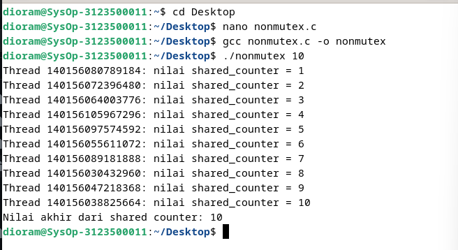

    <h1 style="text-align: center;font-weight: bold">Praktikum 12 SysOp</h1>
    <h4 style="text-align: center;">Dosen Pengampu : Dr. Ferry Astika Saputra, S.T., M.Sc.</h4>

 

    
    <h3 style="text-align: center;">Disusun Oleh : </h3>
    

        <strong>Roihanah Inayati Bashiroh (3123500005)</strong> 
        <strong>Dio Ramadhan Widya Pamungkas (3123500011)</strong> 
        <strong>Ragil Ridho Saputra (3122500016)</strong>
    

<h3>Politeknik Elektronika Negeri Surabaya Departemen Teknik
Informatika Dan Komputer Program Studi Teknik Informatika 2023/2024</h3>
    

    

# SOAL NO 1

## Non Mutex
#### Source code
    #include <pthread.h>
    #include <stdio.h>
    #include <stdlib.h>

    int shared_counter = 0;
    pthread_mutex_t mutex = PTHREAD_MUTEX_INITIALIZER;

    void *thread_function(void *arg)
    {
    pthread_t tid = pthread_self();

    // Mengunci mutex sebelum mengakses shared_counter
    pthread_mutex_lock(&mutex);
    shared_counter++;
    printf("Thread %ld: nilai shared_counter = %d\n", (long)tid, shared_counter);
    // Membuka kunci mutex setelah mengakses shared_counter
    pthread_mutex_unlock(&mutex);

    return NULL;
    }

    int main(int argc, char *argv[])
    {
    if (argc != 2)
    {
        printf("Gunakan: %s <number_of_threads>\n", argv[0]);
        exit(EXIT_FAILURE);
    }

    int num_threads = atoi(argv[1]);

    pthread_t *threads = (pthread_t *)malloc(num_threads * sizeof(pthread_t));

    if (threads == NULL)
    {
        perror("malloc");
        exit(EXIT_FAILURE);
    }

    for (int i = 0; i < num_threads; i++)
    {
        int status = pthread_create(&threads[i], NULL, thread_function, NULL);
        if (status != 0)
        {
            printf("Error: pthread_create() returned error code %d\n", status);
            exit(EXIT_FAILURE);
        }
    }

    for (int i = 0; i < num_threads; i++)
    {
        int status = pthread_join(threads[i], NULL);
        if (status != 0)
        {
            printf("Error: pthread_join() returned error code %d\n", status);
            exit(EXIT_FAILURE);
        }
    }

    free(threads);

    printf("Nilai akhir dari shared counter: %d\n", shared_counter);

    return 0;
    }
    

#### Output

#### Analisa
## Analisis Program Multithreading C dengan Pthread

Program ini mendemonstrasikan penggunaan pustaka `pthread` (POSIX Threads) dalam bahasa C untuk membuat dan menjalankan beberapa thread secara paralel. Tujuannya adalah untuk menunjukkan bagaimana thread dapat digunakan untuk melakukan operasi sederhana, yaitu menambahkan nilai pada variabel `shared_counter` oleh setiap thread, sambil menghindari kondisi balapan (race condition) melalui penggunaan mutex. Dengan ini, program memastikan bahwa akses terhadap variabel bersama dilakukan secara aman dan terkoordinasi.

**Fungsi Utama (main):**

Fungsi `main` mengatur validasi input, alokasi memori, pembuatan thread, dan penyelesaian thread. Pertama-tama, program meminta pengguna untuk memasukkan jumlah thread yang ingin dibuat melalui argumen baris perintah. Jika argumen tidak valid, program akan menampilkan pesan kesalahan dan keluar. Setelah memvalidasi input pengguna, program mengalokasikan memori yang diperlukan untuk menyimpan ID thread. Kemudian, program melakukan iterasi untuk membuat thread sebanyak jumlah yang diminta, menggunakan fungsi `pthread_create` untuk menciptakan setiap thread. Setelah semua thread dibuat, `pthread_join` digunakan untuk menunggu semua thread selesai sebelum mencetak nilai akhir dari `shared_counter` dan membebaskan memori yang telah dialokasikan.

**Fungsi Thread (thread_function):**

Fungsi `thread_function` bertanggung jawab untuk mengakses dan memodifikasi variabel `shared_counter` secara aman. Setiap thread yang dibuat akan menjalankan fungsi ini. Di dalam fungsi ini, pertama-tama, ID thread yang sedang berjalan diperoleh menggunakan `pthread_self()`. Kemudian, mutex dikunci dengan `pthread_mutex_lock` sebelum mengakses `shared_counter` untuk memastikan tidak ada thread lain yang dapat mengaksesnya secara bersamaan. Setelah mengunci mutex, nilai `shared_counter` ditambah satu dan kemudian mutex dibuka kembali dengan `pthread_mutex_unlock`. Hal ini mencegah kondisi balapan dan memastikan bahwa perubahan terhadap `shared_counter` dilakukan secara atomik.

**Penggunaan Mutex:**

Penggunaan mutex adalah inti dari mekanisme sinkronisasi dalam program ini. Mutex diinisialisasi menggunakan `PTHREAD_MUTEX_INITIALIZER` dan digunakan untuk mengunci akses ke `shared_counter` sebelum operasi penambahan dan membuka kunci setelah operasi selesai. Dengan cara ini, mutex mencegah kondisi balapan yang dapat terjadi jika beberapa thread mencoba mengakses dan memodifikasi `shared_counter` pada saat yang sama. Penggunaan mutex memastikan bahwa hanya satu thread yang dapat mengakses `shared_counter` pada satu waktu, menjaga integritas data dan konsistensi hasil akhir.

## Mutex
#### Source code
    #include <pthread.h>
    #include <stdio.h>
    #include <stdlib.h>
    #include <stdint.h>  // Untuk intptr_t

    int shared_counter = 0;
    pthread_mutex_t shared_counter_mutex = PTHREAD_MUTEX_INITIALIZER;

    void *thread_function(void *thread_id) 
    {
    intptr_t tid = (intptr_t)thread_id;

    pthread_mutex_lock(&shared_counter_mutex);

    shared_counter++;

    printf("Thread %ld: shared_counter = %d\n", tid, shared_counter);

    pthread_mutex_unlock(&shared_counter_mutex);

    return NULL;
    }

    int main(int argc, char *argv[]) 
    {
    if (argc != 2) {
        printf("Penggunaan: %s <number_of_threads>\n", argv[0]);
        exit(EXIT_FAILURE);
    }

    int num_threads = atoi(argv[1]);

    pthread_t *threads = (pthread_t *)malloc(num_threads * sizeof(pthread_t));
    if (threads == NULL) {
        printf("Error: Failed to allocate memory for threads\n");
        exit(EXIT_FAILURE);
    }

    for (intptr_t i = 0; i < num_threads; i++) 
    {
        int status = pthread_create(&threads[i], NULL, thread_function, (void *)i);
        if (status != 0) 
        {
            printf("Error: pthread_create() returned error code %d\n", status);
            free(threads);  // Jangan lupa membebaskan memori sebelum keluar
            exit(EXIT_FAILURE);
        }
    }

    for (int i = 0; i < num_threads; i++) {
        int status = pthread_join(threads[i], NULL);
        if (status != 0) 
        {
            printf("Error: pthread_join() returned error code %d\n", status);
            free(threads);  // Jangan lupa membebaskan memori sebelum keluar
            exit(EXIT_FAILURE);
        }
    }

    free(threads);

    printf("Nilai akhir dari shared_counter: %d\n", shared_counter);

    return 0;
    }

#### Output

#### Analisa
Program ini mendemonstrasikan penggunaan pustaka pthread (POSIX Threads) dalam bahasa C untuk membuat dan menjalankan beberapa thread secara paralel. Tujuannya adalah untuk menunjukkan bagaimana thread dapat digunakan untuk melakukan operasi sederhana, yaitu menambahkan nilai pada variabel shared_counter oleh setiap thread, sambil menghindari kondisi balapan (race condition) melalui penggunaan mutex. Dengan ini, program memastikan bahwa akses terhadap variabel bersama dilakukan secara aman dan terkoordinasi.

Pada bagian awal program, terdapat deklarasi variabel global shared_counter dan inisialisasi mutex shared_counter_mutex. Variabel shared_counter digunakan sebagai counter bersama yang akan diakses dan dimodifikasi oleh setiap thread. Mutex digunakan untuk mengontrol akses ke shared_counter, sehingga hanya satu thread yang dapat mengaksesnya pada satu waktu. Ini penting untuk mencegah kondisi balapan di mana beberapa thread mengakses dan memodifikasi variabel secara bersamaan, yang dapat menyebabkan hasil yang tidak konsisten atau salah.

Fungsi thread_function bertanggung jawab untuk melakukan operasi pada shared_counter. Setiap thread yang dibuat akan menjalankan fungsi ini. Dalam fungsi ini, ID thread (tid) diambil dari argumen yang diterima, dan kemudian mutex dikunci menggunakan pthread_mutex_lock sebelum mengakses shared_counter. Setelah mengunci mutex, nilai shared_counter ditambah satu, dan hasilnya dicetak. Setelah itu, mutex dibuka kembali menggunakan pthread_mutex_unlock. Proses penguncian dan pembukaan mutex ini memastikan bahwa hanya satu thread yang dapat mengakses shared_counter pada satu waktu, sehingga mencegah kondisi balapan.

Fungsi main mengatur validasi input, alokasi memori, pembuatan thread, dan penyelesaian thread. Pertama-tama, program memeriksa argumen baris perintah untuk memastikan bahwa pengguna telah memasukkan jumlah thread yang diinginkan. Jika argumen tidak valid, program akan menampilkan pesan kesalahan dan keluar. Setelah memvalidasi input, program mengalokasikan memori untuk array threads yang akan menyimpan ID dari setiap thread yang dibuat. Program kemudian membuat thread sebanyak jumlah yang diminta menggunakan pthread_create, dan setiap thread menjalankan thread_function. Setelah semua thread dibuat, pthread_join digunakan untuk menunggu semua thread selesai sebelum mencetak nilai akhir dari shared_counter dan membebaskan memori yang dialokasikan.

Program ini secara efektif menggunakan pthread untuk membuat dan menjalankan beberapa thread secara paralel, sambil menghindari kondisi balapan melalui penggunaan mutex. Program ini menunjukkan konsep dasar dalam pemrograman multithreading dan mekanisme sinkronisasi di C, serta dapat berfungsi sebagai titik awal untuk implementasi yang lebih kompleks. Kelebihan dari program ini adalah mudah dipahami dan dipelajari, serta menunjukkan penggunaan mutex untuk menghindari kondisi balapan. Namun, operasi yang dilakukan cukup sederhana dan penanganan kesalahan bisa diperbaiki lebih lanjut. Untuk perbaikan, program dapat diperluas untuk melakukan operasi yang lebih kompleks dan mencakup penanganan kesalahan yang lebih baik, serta eksplorasi algoritma sinkronisasi lain seperti read-write locks atau semaphores.
