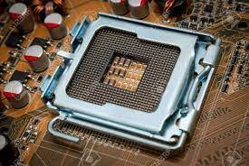
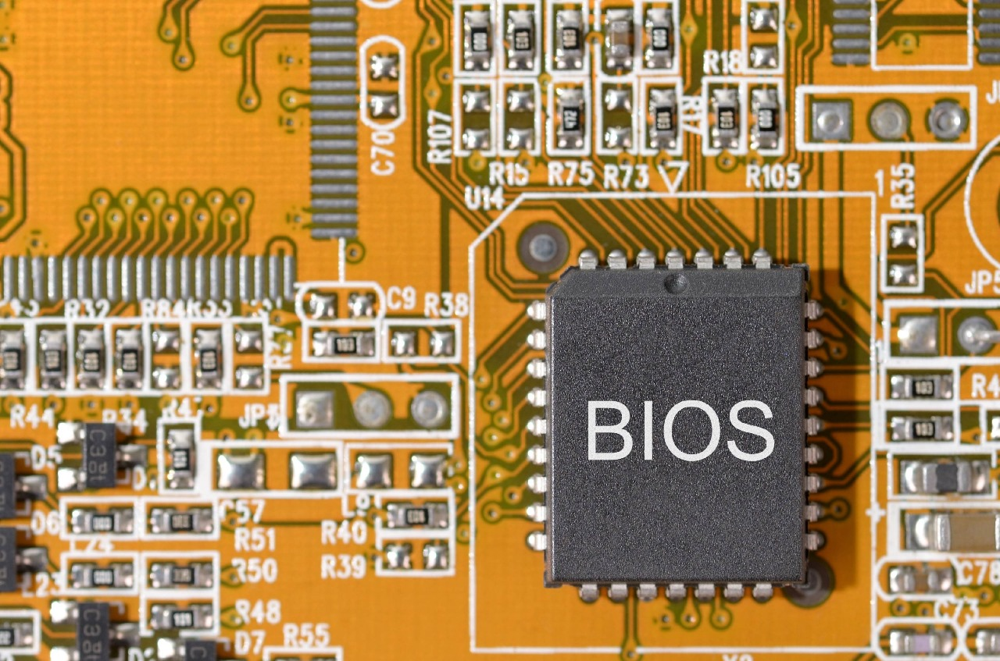
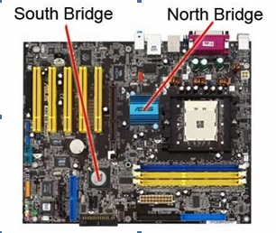
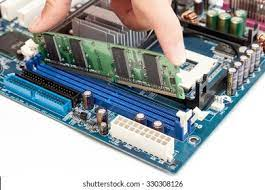
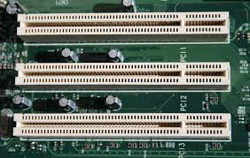
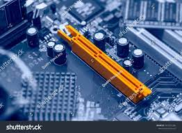
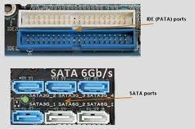
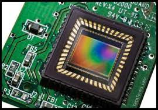
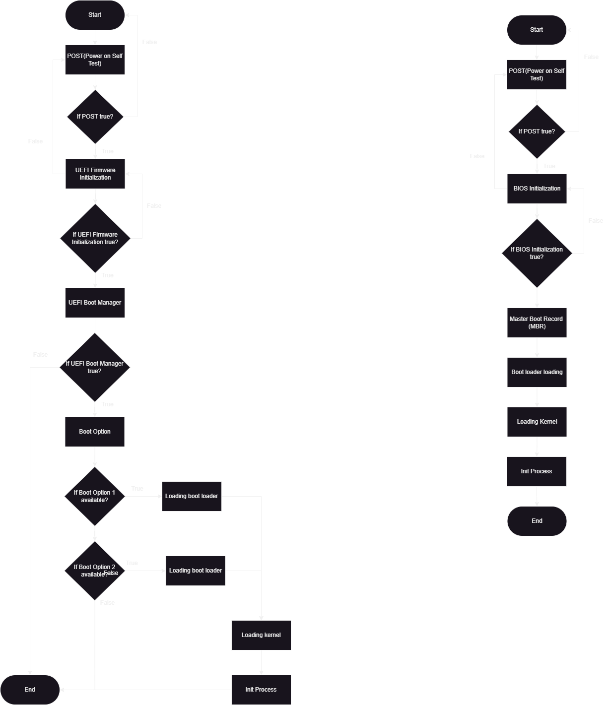

  <h1 style="text-align: center;font-weight: bold">Praktikum 2 SysOp</h1>
  <h4 style="text-align: center;">Dosen Pengampu : Dr. Ferry Astika Saputra, S.T., M.Sc.</h4>

 

  
  <h3 style="text-align: center;">Disusun Oleh : </h3>
  

    <strong>Roihanah Inayati Bashiroh (3123500005)</strong> 
    <strong>Dio Ramadhan Widya Pamungkas (3123500011)</strong> 
    <strong>Ragil Ridho Saputra (3122500016)</strong>
  

  <h3 style="text-align: center;line-height: 1.5">Politeknik Elektronika Negeri Surabaya Departemen Teknik
    Informatika Dan Komputer Program Studi Teknik Informatika 2023/2024</h3>
  

  

## Daftar Isi
1. [Komposisi MotherBoard](#Komposisi-MotherBoard)
2. [Perbedaan Legacy&UEFI](#Perbedaan-Legacy&UEFI)

## Komposisi MotherBoard

1. Socket CPU: Ada ZIF (Zero Insertion Force), LIF (Low Insertion Force), dan AMD Socket A.

2. BIOS (Basic Input-Output System): Program dasar yang menghubungkan motherboard dengan sistem operasi.

3. North Bridge Controller: Menghubungkan slot RAM, AGP, dan socket CPU.

4. South Bridge Controller: Mengatur peripheral seperti USB, keyboard, IDE controller, dll.

5. Konektor Power Supply Unit: Menyambungkan motherboard dengan power supply, AT atau ATX.

6. Socket CPU: Ada ZIF (Zero Insertion Force), LIF (Low Insertion Force), dan AMD Socket A.

7. BIOS (Basic Input-Output System): Program dasar yang menghubungkan motherboard dengan sistem operasi.

8. North Bridge Controller: Menghubungkan slot RAM, AGP, dan socket CPU.

9. South Bridge Controller: Mengatur peripheral seperti USB, keyboard, IDE controller, dll.

10. Konektor Power Supply Unit: Menyambungkan motherboard dengan power supply, AT atau ATX.

## Perbedaan Legacy&UEFI

1. Definisi Unified Extensible Firmware Interface (UEFI) adalah proses booting pada komputer modern dengan kemampuan lebih canggih dibanding sistem Legacy. UEFI menggunakan firmware URFI untuk menyimpan EFI Service Partitions saat proses booting berlangsung. Sementara, Legacy adalah proses booting komputer dengan firmware BIOS yang lebih lama dan tradisional.

2. Waktu yang Dibutuhkan UEFI membutuhkan waktu booting yang lebih cepat. Sedangkan, Legacy lebih lama.

3. Dukungan untuk Penyimpanan UEFI sudah menggunakan partisi GUID Partition Table (GTP), sehingga dapat mendukung perangkat penyimpanan hingga 9 zettabytes. Legacy yang masih menggunakan dukungan Master Boot Record (MBR) dapat mendukung perangkat penyimpanan komputer hanya 2 TB.

4. Keamanan UEFI dapat mencegah pemuatan aplikasi yang tak sah atau dicurigai. Selain itu juga dapat menghambat adanya kerja dua boot karena UEFI menganggap sistem operasi adalah aplikasi. ADVERTISEMENT Namun, pada Legacy, tak ada keamanan yang disediakan saat booting berlangsung, sehingga ada kemungkinan aplikasi tak sah dimuat serta terjadi dual-boot.

### Flowchart
 

