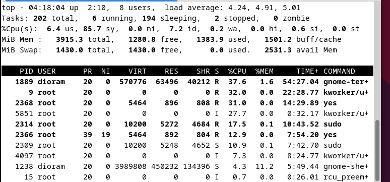

    <h1 style="text-align: center;font-weight: bold">Praktikum 6 SysOp</h1>
    <h4 style="text-align: center;">Dosen Pengampu : Dr. Ferry Astika Saputra, S.T., M.Sc.</h4>

 

    
    <h3 style="text-align: center;">Disusun Oleh : </h3>
    

        <strong>Roihanah Inayati Bashiroh (3123500005)</strong> 
        <strong>Dio Ramadhan Widya Pamungkas (3123500011)</strong> 
        <strong>Ragil Ridho Saputra (3122500016)</strong>
    

<h3>Politeknik Elektronika Negeri Surabaya Departemen Teknik
Informatika Dan Komputer Program Studi Teknik Informatika 2023/2024</h3>
    

    

## Daftar Isi

1. [Pokok Bahasan](#pokok-bahasan)
2. [Tujuan Belajar](#tujuan-belajar)
3. [Dasar Teori](#dasar-teori)
4. [Laporan Hasil Percobaan 5](#percobaan-5--menghentikan-dan-memulai-kembali-job)
5. [Laporan Hasil Percobaan 6](#percobaan-6--percobaan-dengan-penjadwalan-prioritas)
6. [Laporan Hasil Latihan](#latihan)

# Praktikum 4B | Week - 6

## Proses dan Manajemen Proses

### POKOK BAHASAN

- Proses pada Sistem Operasi Linux
- Manajemen Proses pada Sistem Operasi Linux

### TUJUAN BELAJAR

Setelah mempelajari materi dalam bab ini, mahasiswa diharapkan mampu:

- Memahami konsep proses pada sis tem operasi Linux.
- Menampilkan beberapa cara menampilkan hubungan proses parent dan child.
- Menampilkan status proses dengan beberapa format berbeda.
- Melakukan pengontrolan proses pada shell.
- Memahami penjadwalan prioritas.

### DASAR TEORI

#### 1. KONSEP PROSES PADA SISTEM OPERASI LINUX

Proses adalah program yang sedang dieksekusi. Setiap kali menggunakan utilitas sistem atau program aplikasi dari shell, satu atau lebih proses ”child” akan dibuat oleh shell sesuai perintah yang diberikan. Setiap kali instruksi dibe rikan pada Linux shell, maka kernel akan menciptakan sebuah proses-id. Proses ini disebut juga dengan terminology Unix sebagai sebuah Job. Proses Id (PID) dimulai dari 0, yaitu proses INIT, kemudian diikuti oleh proses berikutnya (terdaftar pada /etc/inittab).
Beberapa tipe proses :

- Foreground  
  Proses yang diciptakan oleh pemakai langsung pada terminal (interaktif, dialog)
- Batch  
  Proses yang dikumpulkan dan dijalankan secara sekuensial (satu persatu). Prose Batch tidak diasosiasikan (berinteraksi) dengan terminal.
- Daemon  
  Proses yang menunggu permintaan (request) dari proses lainnya dan menjalankan tugas sesuai dengan permintaan tersebut. Bila tidak ada request, maka program ini akan berada dalam kondisi “idle” dan tidak menggunakan waktu hitung CPU. Umumnya nama proses daemon di UNIX berakhiran d, misalnya inetd, named, popd dll

#### 2. SINYAL

Proses dapat mengirim dan menerima sinyal dari dan ke proses lainnya. Proses mengirim sinyal melalui instruksi “kill” dengan format  

    kill [-nomor sinyal] PID

Nomor sinyal : 1 s/d maksimum nomor sinyal yang didefinisikan system Standar nomor sinyal yang terpenting adalah :

| No Sinyal | Nama    | Deskripsi                                                                             |
| --------- | ------- | ------------------------------------------------------------------------------------- |
| 1         | SIGHUP  | Hangup, sinyal dikirim bila proses terputus, misalnya melalui putusnya hubungan modem |
| 2         | SIGINT  | Sinyal interrupt, melalui ^C                                                          |
| 3         | SIGQUIT | Sinyal Quit, melalui ^\|                                                              |
| 9         | SIGKILL | Sinyal Kill, menghentikan proses                                                      |
| 15        | SIGTERM | Sinyal terminasi software                                                             |

#### 3. MENGIRIM SINYAL

Mengirim sinyal adalah satu alat komunikasi antar proses, yaitu memberitahukan proses yang sedang berjalan bahwa ada sesuatu yang harus dikendalikan. Berdasarkan sinyal yang dikirim ini maka proses dapat bereaksi dan administrator/programmer dapat menentukan reaksi tersebut. Mengirim sinyal menggunakan instruksi

    kill [-nomor sinyal] PID

Sebelum mengirim sinyal PID proses yang akan dikirim harus diketahui terlebih dahulu.

#### 4. MENGONTROL PROSES PADA SHELL

Shell menyediakan fasilitas job control yang memungkinkan mengontrol beberapa job atau proses yang sedang berjalan pada waktu yang sama. Misalnya bila melakukan pengeditan file teks dan ingin melakukan interrupt pengeditan untuk mengerjakan hal lainnya. Bila selesai, dapat kembali (switch) ke editor dan melakukan pengeditan file teks kembali. 
Job bekerja pada <strong>foreground</strong> atau <strong>background</strong>. Pada foreground hanya diper untukkan untuk satu job pada satu waktu. Job pada foreground akan mengontrol shell - menerima input dari keyboard dan mengirim output ke layar. Job pada background tidak menerima input dari terminal, biasanya berjalan tanpa memerlukan interaksi 
Job pada foreground kemungkinan dihentikan sementara (suspend), dengan menekan [Ctrl-Z]. Job yang dihentikan sementara dapat dijalankan kembali pada foreground atau background sesuai keperluan dengan menekan <strong>”fg”</strong> atau <strong>”bg”</strong>. Sebagai catatan, menghentikan job seme ntara sangat berbeda dengan melakuakan interrupt job (biasanya menggunakan [Ctrl-C]), dimana job yang diinterrup akan dimatikan secara permanen dan tidak dapat dijalankan lagi.

#### 5. MENGONTROL PROSES LAIN

Perintah ps dapat digunakan untuk menunjukkan semua proses yang sedang berjalan pada mesin (bukan hanya proses pada shell saat ini) dengan format :

    ps –fae atau
    ps -aux

Beberapa versi UNIX mempunyai utilitas sistem yang disebut top yang menyediakan cara interaktif untuk memonitor aktifitas sistem. Statistik secara detail dengan proses yang berjalan ditampilkan dan secara terus-menerus di-refresh . Proses ditampilkan secara terurut dari utilitas CPU. Kunci yang berguna pada top adalah

    s – set update frequency
    u – display proses dari satu user
    k – kill proses (dengan PID)
    q – quit

Utilitas untuk melakukan pengontrolan proses dapat ditemukan pada sistem UNIX adalah perintah killall. Perintah ini akan menghentikan proses sesuai PID atau job number proses.

### Percobaan 5 : Menghentikan dan Memulai Kembali Job

1. Perintah `yes > /dev/null`

    

    
   Analisa : Cara lain meletakkan job pada background dengan memulai job secara normal (pada foreground), stop job dan memulai lagi pada background. Gunakan perintah yes > /dev/null untuk memulai job baru. Hentikan sementara job (suspend), bukan menghentikannya (terminate), tetapi menghentikan sementara job sampai di restart. Untuk menghentikan sementara job gunakan Ctrl + Z

    

2. Perintah `fg`

    

    
   Analisa : Perintah `fg` disini digunakan untuk me-restart job pada foreground.

    

3. Perintah `bg`

    

    
   Analisa : Setelah instruksi fg, Shell akan menampilkan nama perintah yang diletakkan di foreground. Stop job lagi dengan Ctrl + Z. Kemudian gunakan perintah bg untuk meletakkan job pada background.Job tidak bisa dihentikan dengan Ctrl + Z karena job berada pada background. Untuk menghentikannya, letakkan job pada foreground dengan fg dan kemudian hentikan sementara dengan Ctrl + Z.

    

4. Perintah `yes &`

    

    
   Analisa : Job pada background dapat digunakan untuk menampilkan teks pada terminal, dimana dapat diabaikan jika mencoba mengerjakan job lain seperti perintah di atas. Untuk menghentikannya tidak dapat menggunakan Ctrl + C. Job harus dipindah ke foreground baru diberhentikan dengan cara tekan fg dan tekan enter, Kemudian lanjutkan dengan Ctrl + Z untuk menghentikan sementara

    

5. Perintah `fg %2, bg %2 atau %2`

    

    
   Analisa :  Perintah di atas digumakan apabila ingin menjalankan banyak job dalam satu waktu, letakkan job pada foreground atau background dengan memberikan job ID.
    

6. Perintah `fg`

    

    
   Analisa : tekan fg dan tekan Enter, kemudian dilanjutkan dengan Ctrl-Z untuk menghentikan sementara

    

7. Perintah `ps -fae`

    

    
   Analisa :  Lihat job dengan perintah ps -fae dan tekan Enter. Kemudian hentikan proses dengan perintah kill. Pada proses di atas proses yang dihentikan adalah proses dengan PID 6142, yaitu proses yes > /dev/null

    

### Percobaan 6 : Percobaan dengan Penjadwalan Prioritas

1. Login sebagai root

2. Buka tiga terminal,tampilkan pada screen yang sama

   

    

3. Pada setiap terminal, ketik `PS1 = ” \w:”` diikuti Enter. `\w` menampilkan path pada direktori home.

   

     

4. Karena login sebagai root, maka akan ditampilkan `~:` pada setiap terminal. Untuk setiap terminal ketik `pwd` dan tekan Enter untuk melihat bahwa Anda sedang berada pada direktori `/root`.

   
5. Buka terminal lagi (keempat), atur posisi sehingga keempat terminal terlihat pada screen

   
  
   

6. Pada terminal keempat, ketik `top` dan tekan _Enter_. Maka program `top` akan muncul. Ketik `i`. Top akan menampilkan proses yang aktif. Ketik `lmt`. `Top` tidak lagi menampilkan informasi pada bagian atas dari screen. Pada percobaan ini, terminal ke empat sebagai jendela `Top`.

  

   
      
  
   
      

7. Pada terminal 1, bukalah program executable C++ dengan mengetik program `yes` dan tekan _enter_.
8. Ulangi langkah 7 untuk terminal 2

9. Jendela Top akan menampilkan dua program `yes` sebagai proses yang berjalan. Nilai `%CPU` sama pada keduanya. Hal ini berarti kedua proses mengkonsumsi waktu proses yang sama dan berjalan sama cepat. _PID_ dari kedua proses akan berbeda, misalnya pada contoh di atas adalah 2366 dan 2366. Kemudian gunakan terminal 3 (yang tidak menjalankan primes maupun Jendela Top) dan ketik _renice 19 2366_ dan diikuti Enter. Hal ini berarti mengganti penjadwalan prioritas dari proses ke 19.

 

10. Tunggu beberapa saat sampai program top berubah dan terlihat pada jendela `Top`. Pada kolom `STAT` memperlihatkan `N` untuk proses 2366. Hal ini berarti bahwa penjadwalan prioritas untuk proses 2366 lebih besar (lebih lambat) dari 0. Proses 2368 berjalan lebih cepat.

      

11. Program _top_ juga mempunyai fungsi yang sama dengan program `renice`. Pilih Jendela _Top_ dan tekan `r`. Program top terdapat prompt PID to renice: tekan 2366 dan tekan Enter. Program top memberikan prompt Renice PID 1889 to value: tekan -19 dan tekan Enter.

       
        
       
      

12. Tunggu beberapa saat sampai top berubah dan lihat nilai %CPU pada kedua proses. Sekarang proses 2366 lebih cepat dari proses 2368. Kolom status menunjukkan < pada proses 1889 yang menunjukkan penjadwalan prioritas lebih rendah (lebih cepat) dari nilai 0

       

13. Pilih terminal 3 (yang sedang tidak menjalankan yes atau program top) dan ketik nice –n -10 yes dan tekan Enter. Tunggu beberapa saat agar program top berubah dan akan terlihat proses primes ketiga. 

       

14. Jangan menggunakan mouse dan keyboard selama 10 detik. Program top menampilkan proses yang aktif selain program yes. Maka akan terlihat proses top terdaftar tetapi %CPU kecil (dibawah 1.0) dan konsisten. Juga terlihat proses berhubungan dengan dekstop grafis seperti X, panel dll.

       

15. Pindahkan mouse sehingga kursor berubah pada screen dan lihat apa yang terjadi dengan tampilan top. Proses tambahan akan muncul dan nilai %CPU berubah sebagai bagian grafis yang bekerja. Satu alasan adalah bahwa proses 2314 berjalan pada penjadwalan prioritas tinggi. Pilih jendela Top, ketik `r`. `PID to renice :` muncul prompt. Ketik 2314 dan tekan Enter. `Renice PID 2314 to value:` muncul prompt. Ketik 0 dan tekan Enter. Sekarang pindahkan mouse ke sekeliling screen. Lihat perubahannya

       

        
       
       

16. Tutup semua terminal window.

17. Logout dan login kembali sebagai user.

### Latihan

1. Masuk ke tty2 dengan Ctrl+Alt+F2. Ketik ps –au dan tekan Enter. Kemudian perhatikan keluaran sebagai berikut :

     
   - Sebutkan nama-nama proses yang bukan root

     - Semua proses kecuali `/bin/login -p--` adalah bukan root

   - Tulis PID dan COMMAND dari proses yang paling banyak menggunakan CPU time

     - PID : 1135
     - COMMAND : -bash

   - Sebutkan buyut proses dan PID dari proses tersebut

     - `/usr/libexec/gdm-wayland-session` dengan PID 656

   - Sebutkan beberapa proses daemon

     - Pada beberapa proses yang tampil pada gambar di atas, tidak ada proses daemon.

   - Pada prompt login lakukan hal- hal sebagai berikut : `$ csh` `$ who` `$ bash` `$ ls` `$ sh` `$ ps`

     

     Analisa :
     Perintah `$ bash` digunakan untuk mengkonversi instruksi yang dimasukkan ke dalam bahasa biner yang dapat di mengerti oleh kernel Linux, perintah `$ ls` digunakan untuk menunjukkan semua file yang ada dalam direktori aktif, dan perintah `$ csh` adalah sebuah shell interaktif yang memiliki lebih banyak sintaks dibandingkan dengan Bourne Shell. PID, TTY, TIME, dan CMD membentuk empat kolom utama tampilan perintah ps, yang menampilkan daftar proses yang sedang berlangsung dalam sistem. Perintah `$ who` menampilkan daftar pengguna yang saat ini masuk ke sistem. Ini menunjukkan nama pengguna, terminal yang mereka gunakan, waktu login, dan informasi lainnya. Perintah ini digunakan dengan sering untuk mengetahui siapa yang sedang menggunakan sistem atau

   - Sebutkan PID yang paling besar dan kemudian buat urut-urutan proses sampai ke PPID = 1.

       

     - PID = 1557 (ps)
     - PID = 1556 (sh)
     - PID = 1553 (bash)
     - PID = 1551 (csh)
     - PID = 1128 (bash)

2. Cobalah format tampilan ps dengan opsi berikut dan perhatikan hasil tampilannya :

   - `-f` daftar penuh

      

      Analisa : Output dapat ditampilkan dalam format yang lengkap atau penuh dengan menggunakan opsi `-f`. Ini biasanya mengandung data seperti pengguna yang menjalankan proses, PID (identifikasi proses), PID induk (identifikasi proses parental), waktu mulai proses, dan perintah yang dijalankan.

   - `-j` format job

       

       Analisa : Informasi job control untuk setiap proses ditampilkan dengan opsi -j. Dalam sistem Unix/Linux, ada mekanisme yang dikenal sebagai job control, yang memungkinkan pengguna mengawasi dan mengontrol proses yang berjalan di terminal.
     

   - `j` format job control

       

   - `l` daftar memanjang

       

        Analisa : Untuk menampilkan output yang lebih luas, opsi -l biasanya menyertakan informasi tambahan seperti nama lengkap pengguna yang menjalankan proses, perintah yang dijalankan, dan waktu mulai proses.
     

   - `s` format sinyal

       

         Analisa : Opsi `s` dapat menampilkan informasi tentang sinyal yang dikirimkan kepada proses. Misalnya, jika Anda menggunakan `ps s`, Anda dapat melihat daftar sinyal yang telah dikirimkan kepada proses dengan ID proses (PID) tertentu.

   - `v` format virtual memory

       

       Analisa :Opsi `v` menampilkan informasi tentang penggunaan memori virtual oleh setiap proses. Ini mencakup ukuran memori virtual total yang dialokasikan, ukuran memori virtual yang saat ini digunakan, dan ukuran memori yang terlibat, yang merupakan memori yang diambil dari memori fisik.
     

   - `X` format register i386

       

        Analisa : Semua proses, bahkan yang tidak terkait dengan terminal pengguna (tidak terkendali), dapat ditampilkan dengan opsi `X`.

3. Lakukan urutan pekerjaan berikut :

   - Gunakan perintah `find` ke seluruh direktory pada sistem, belokkan output sehingga daftar direktori dialihkan ke file `directories.txt` dan daftar pesan error dialihkan ke file `errors.txt`

      

        Analisa : Perintah `find` dapat mencari ke seluruh direktori sistem, dimulai dari root directory (/). Untuk menyimpan daftar lengkap dari semua direktori dalam sistem ke dalam sebuah file, kita dapat mengalihkan output perintah `find` ke file `directories.txt`. Dengan menggunakan `2>` errors untuk memisahkan pesan error, Anda dapat menangkap dan menyimpan pesan error, jika ada, ke dalam file yang disebut `errors`.
     

   - Gunakan perintah `sleep 5`. Apa yang terjadi dengan perintah ini ?

      

       Analisa : Perintah `sleep` digunakan dalam sistem operasi Unix/Linux untuk membuat proses tertunda, atau tidur, untuk jangka waktu tertentu (waktu yang telah dideklarasikan, semisal pada contoh diatas 5 => 5 second) sebelum melanjutkan eksekusi perintah berikutnya.

   - Jalankan perintah pada background menggunakan `&`

      

       Analisa : Proses akan berjalan di background dengan nomor PID yang telah ditampilkan.

   - Jalankan `sleep 15` pada foreground, hentikan sementara dengan Ctrl-Z dan kemudian letakkan pada background dengan `bg`. Ketikkan `jobs`. Ketikkan `ps`. Kembalikan job ke foreground dengan perintah `fg`.

       

         Analisa : Proses untuk memunda proses berikutnya selama 15 second setelah dihentikan sementara di cek pada background menggunakan perintah `bg` dan diperiksa apakah ada jobs saat ini menggunakan perintah `jobs` disini akan muncull PID beserta nama dari proses tersebut. terakhir ketik perintah `fg` untuk melanjutkan proses `sleep 15`.
     

   - Jalankan `sleep 15` pada background menggunakan `&` dan kemudian gunakan perintah `kill` untuk menghentikan proses diikuti job number.

     

  Analisa : Menjalankan proses delay selama 15 dan ditempatkan pada background menjadi `sleep 15 &`, setelah itu di cek menggunakan perintah `ps` dan `jobs` agar dapat melihat proses tersebut berjalan pada background. kill %1 untuk menghentikan proses sesuai PID yang tertera pada perintah `jobs` maka setelah di cek menggunakan perintah `ps` akan tampil bahwa proses `sleep 15` akan berhenti atau berganti status dari `Running` menjadi `Terminated`

   - Jalankan `sleep 15` pada background menggunakan `&` dan kemudian gunakan `kill` untuk menghentikan sementara proses. Gunakan `bg` untuk melanjutkan menjalankan proses.

     
     
  Analisa : Menjalankan proses delay lagi selama 15 second pada background dengan perintah `sleep 15 &` lalu cek menggunakan perintah `ps` atau `jobs`, jalankan perintah `kill` untuk menghentikan proses sementara.

   - Jalankan `sleep 60` pada background 5 kali dan terminasi semua pada dengan menggunakan perintah `killall`.

      
      
      
  Analisa : Menjalankan proses delay selama 60 second sebanyak 5 kali dan ditempatkan pada background perintahnya `sleep 60 &` lalu setiap proses tersebut akan diberi PID untuk masing - masing proses. cek menggunakan perintah `ps` untuk menampilkan proses yang berlajan saat ini. ketikan perintah `killall sleep` maka akan menghentikan setiap program atau proses yang bernama sleep cek kembali menggunakan perintah `ps` maka proses sleep tidak akan ada karena telah dihentikan dan statusnya telah terminated.
  

   - Gunakan perintah `ps`, `w` dan `top` untuk menunjukkan semua proses yang sedang dieksekusi.

      
          
      

        Analisa : Kombinasi perintah ps aux, w, dan top memberikan tampilan menyeluruh dari semua proses yang sedang dieksekusi di sistem Linux. Perintah ps aux memberikan detail tentang setiap proses, termasuk PID, pengguna yang menjalankannya, dan penggunaan CPU, sementara w memberikan tampilan aktivitas login pengguna. Top memberikan tampilan waktu nyata yang memungkinkan pemantauan langsung terhadap penggunaan CPU, memori, dan proses-proses.

   - Gunakan perintah `ps –aeH` untuk menampilkan hierarki proses. Carilah init proses. Apakah Anda bisa identifikasi sistem daemon yang penting ? Dapatkan Anda identifikasi shell dan subproses ?

     

   - Kombinasikan `ps –fae` dan grep, apa yang Anda lihat ?

     
     
 Analisa : Perintah ps -fae digunakan untuk menampilkan semua proses yang sedang berjalan pada mesin. Saat digabungkan dengangan grep menggunakan pipelining, maka hanya akan ditampilkan proses yang dicari menggunakan grep tersebut. Pada contoh ini, saya mencari proses yang ada pada tty2, yaitu terminal yang sedang saya gunakan. Dapat dilihat bahwa ada 2 proses pada tty2.

   - Jalankan proses `sleep 300` pada background. Log off komputer dan log in kembali. Lihat daftar semua proses yang berjalan. Apa yang terjadi pada proses sleep ?

     

  Analisa : Yang terjadi ialah proses sleep tidak lagi dalam keadaan Running. Hal ini bisa terjadi karena kita keluar dari terminal dan itu otomatis membuat semua proses yang dijalankan oleh user yang log off ikut berhenti.
